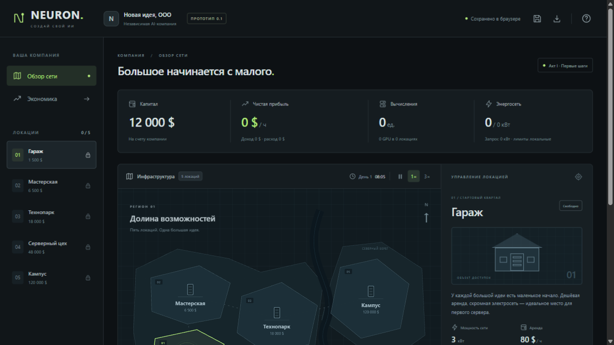
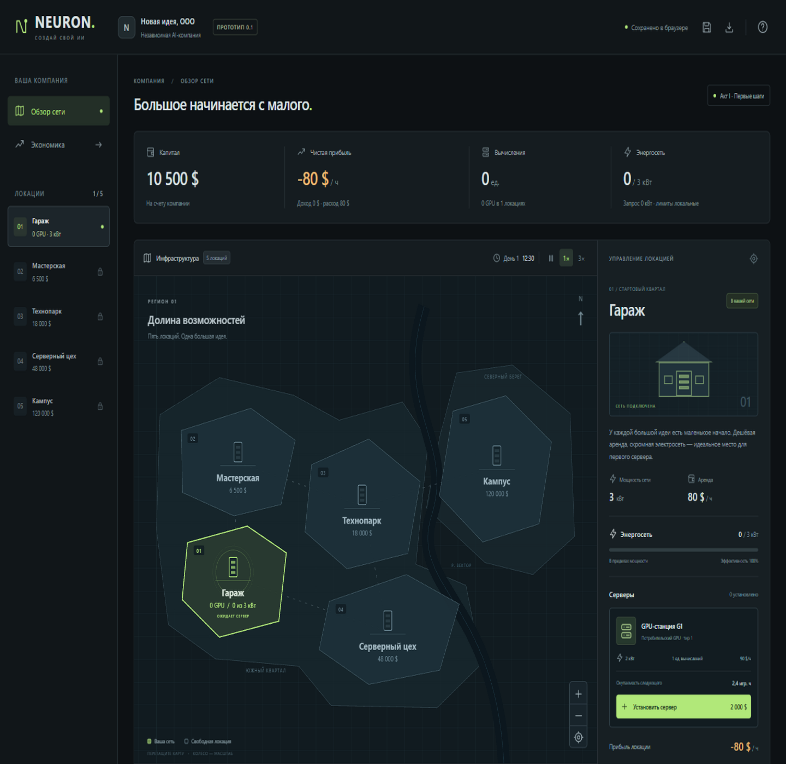
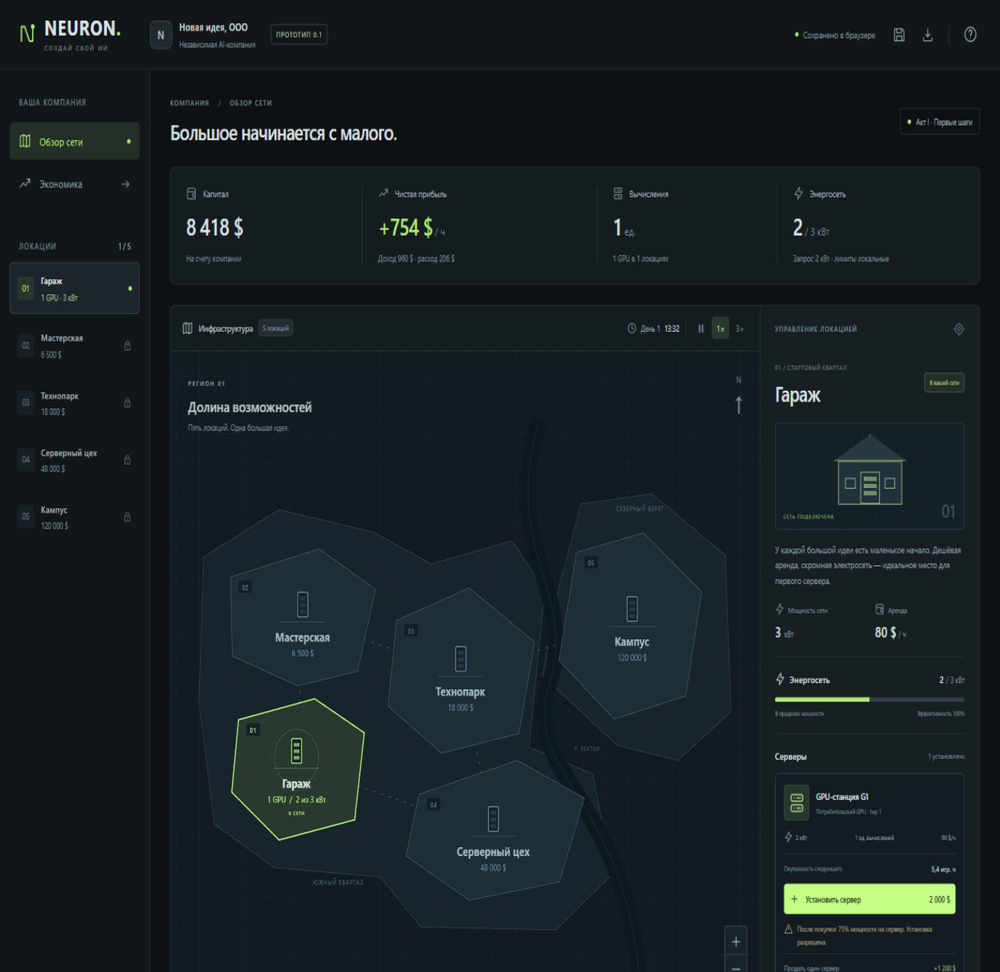
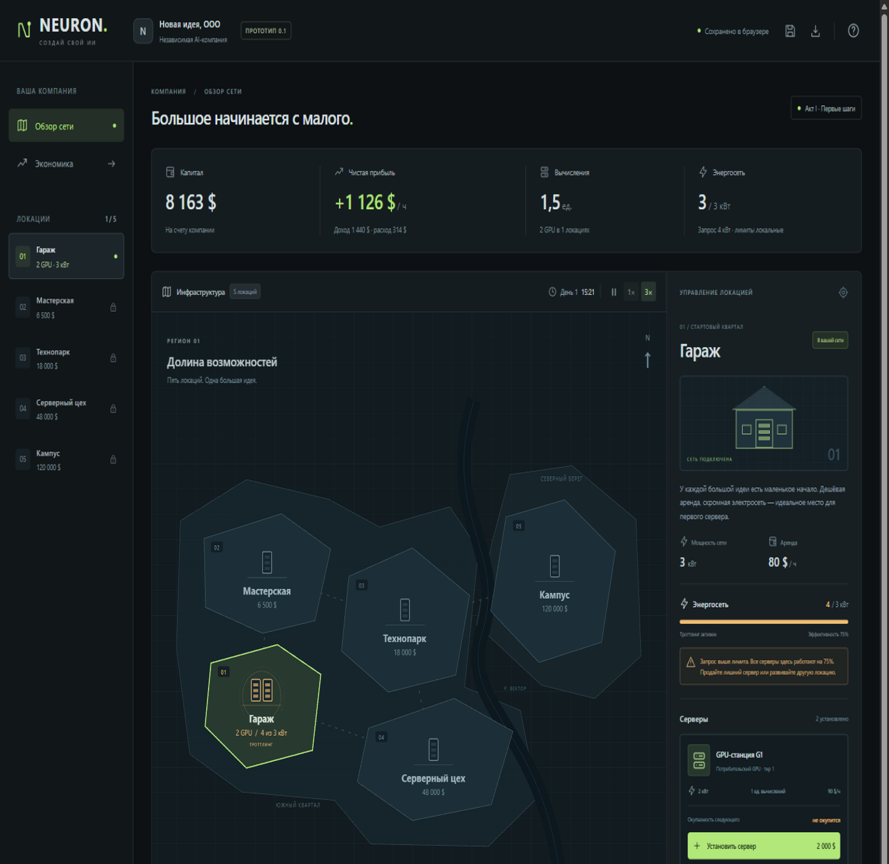
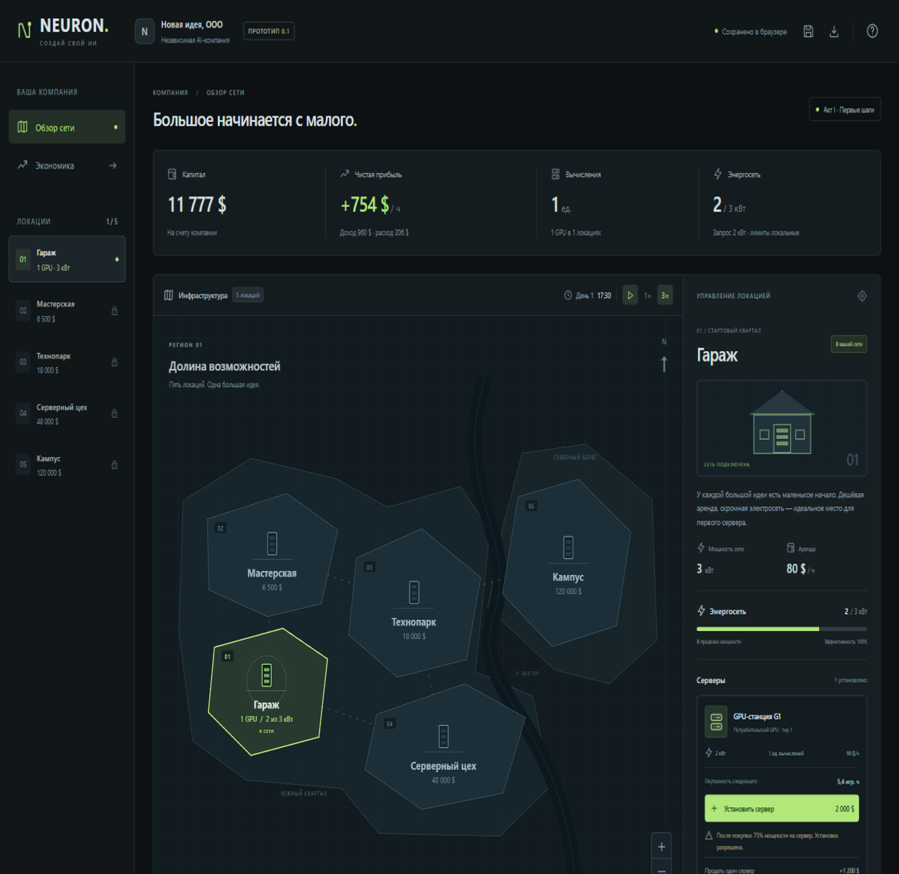
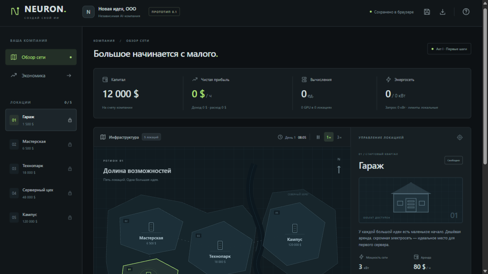

# GUI-проверка «Создай свой ИИ» / NEURON — Фаза 0

Дата: 5 сентября 2026 года.

## Итог

Основной экономический цикл проверен реальными интерфейсными действиями во встроенном браузере ZCode. Полный GUI-прогон **не завершён** из-за повторяющихся сбоев браузерного инструмента. Это не полная приёмка Фазы 0: интерактивная карта и некоторые дополнительные сценарии остаются непроверенными.

В этом прогоне код игры не изменялся, обработчики не вызывались через JavaScript, состояние игры и IndexedDB не подменялись. Использовались DOM CUA-клики по наблюдаемым элементам, координатные CUA-клики по карте, перезагрузка страницы, снимки и чтение DOM. `evaluate` использовался только для чтения `document.hidden`, `document.visibilityState` и размеров окна.

## Подготовка окружения

- Проверено: сервер разработки уже слушал 127.0.0.1:5173. Он не перезапускался.
- Отдельно запущен production preview: `npm run preview -- --port 5174 --strictPort`.
- Тестовый адрес: http://127.0.0.1:5174/ — отдельное origin-хранилище, не затрагивающее компанию на порту 5173.
- Открыт встроенный браузер ZCode, внешний пользовательский браузер не запускался.
- Начальные условия: 12 000 $, пять неприобретённых локаций, ноль серверов. Искусственного наполнения сейва не было.
- Начальная вкладка сообщала `document.hidden = true`. После переоткрытия и подготовки размера 1440 × 1400 она сообщала `false`, часы начали двигаться.
- После зависаний захвата вкладка переоткрывалась. Затронутые пункты помечены как неполные, а не как успешно пройденные. В последней попытке подготовки использовался размер 1440 × 1080.

## Проверенные сценарии

### T01. Первый запуск и валюта — пройдено

Отрисованы карта, пять локаций, стартовый капитал 12 000 $, выбранный гараж, цена гаража 1 500 $ и аренда 80 $/ч. Валюта в DOM и на снимке — доллары. Полная оценка удобства вёрстки на всех размерах не проводилась.

### T04. Покупка гаража — пройдено

Нажата видимая кнопка «Купить локацию» через DOM CUA. Количество площадок выросло с 0 до 1, капитал уменьшился до 10 500 $, площадка приобрела статус «В вашей сети», появился каталог серверов. Пустая площадка даёт расход 80 $/ч.

### T05. Первый сервер — пройдено

Нажата «Установить сервер». Установлен один GPU, потребление 2 из 3 кВт, эффективность 100%, выручка 960 $/ч, расходы 206 $/ч, чистая прибыль 754 $/ч. Капитал 8 418 $, а не ровно 8 500 $, поскольку между покупкой площадки и установкой оборудования шла аренда.

### T06. Реальное накопление дохода — пройдено

Без дополнительных покупок капитал вырос с 8 418 до 8 980 $. Отображаемая прибыль оставалась 754 $/ч. Время и деньги не изменялись программно.

### T07. Превышение мощности — пройдено

Второй GPU разрешено установить. Запрос стал 4 кВт при лимите 3 кВт, эффективность — 75%. Вычисления 1,5 единицы, выручка 1 440 $/ч, расходы 314 $/ч, прибыль 1 126 $/ч. Видны предупреждение и янтарная индикация. Для третьего сервера интерфейс показывает «не окупится».

### T08. Переключение скорости — пройдено для выбора режима

DOM CUA-кликом включён режим 3×. Его `aria-pressed` стал `true`, кнопка визуально выделена, капитал и часы продолжали расти. Точное отношение скоростей по секундомеру в этом GUI-прогоне не измерялось; математическая проверка скорости относится к ранее выполненным юнит-тестам.

### T09. Пауза — пройдено через DOM CUA

Нажатие паузы через DOM CUA изменило кнопку на «Продолжить симуляцию». Время остановилось на 17:30, капитал — на 10 577 $. Значения сохранились в следующих наблюдениях до отдельной операции продажи. Обычный Playwright locator-click в этом же браузере не проходил: см. ограничения инструмента ниже.

### T10–T11. Ручное сохранение и восстановление после перезагрузки — пройдено

Нажата кнопка сохранения. DOM показал «Компания сохранена в этом браузере». После перезагрузки восстановились капитал 10 577 $, гараж с двумя GPU, прибыль 1 126 $/ч, троттлинг 75%, пауза и выбранная скорость 3×.

### T12. Продажа GPU — пройдено

На паузе нажата «Продать один сервер». Капитал вырос точно с 10 577 до 11 777 $ (+1 200 $, 60% цены GPU). Остался один сервер, эффективность вернулась к 100%, мощность — к 2 из 3 кВт, прибыль — к 754 $/ч.

## Неполные и заблокированные сценарии

| Сценарий | Фактический результат |
| --- | --- |
| Клик по полигону мастерской | В первой попытке после координатного клика DOM показывал «Мастерская», но снимок результата завис. Позднейший координатный клик не подтвердил смену выбора. Сквозная визуальная проверка не пройдена. |
| Панорамирование, колесо, кнопки зума и сброс вида | Не проверены до блокировки инструмента. |
| Все пять локаций, покупка второй площадки, нехватка денег | Не проверены обычным GUI-прогоном. |
| Справка | DOM CUA открыл диалог с правильными долларовыми ценами, но снимок недоступен из-за зависшего захвата. Пункт неполный. |
| Экономическая модалка | Не проверена. |
| Отдельная кнопка загрузки, подтверждение/отмена | Не проверены; подтверждено только восстановление при перезагрузке. |
| Автосохранение продажи | После переоткрытия DOM показывал один GPU и 11 777 $, но новый снимок не получен. Пункт неполный. |
| Новая компания, подтверждение/отмена сброса | Не проверены. |
| Возобновление после паузы | Смена на кнопку «Продолжить» подтверждена, нажатие «Продолжить» отдельно не проверено. |
| Мобильная и планшетная вёрстка | Не проверены. |
| Закрытие/скрытие вкладки и отсутствие офлайн-дохода | Не проведён отдельный контролируемый сценарий. |

Отсутствие результата не означает дефект игры. Эти пункты нельзя учитывать как пройденные.

## Ограничения инструмента ZCode

1. Playwright locator-click по видимой и доступной кнопке «Приостановить симуляцию» дважды завершался таймаутом. Более поздний самостоятельный DOM CUA-сценарий успешно поставил игру на паузу без программного вызова обработчика.
2. После координатных кликов по карте захват снимков возвращал `browser 命令 screenshot 超时（30000ms）`, затем `A previous screenshot for this browser tab is still completing after timeout`. Достоверная причина на стороне игры или среды не установлена.
3. Захват также возвращал `browser screenshot activity capture failed for guest` непосредственно после перезагрузки. Один такой случай восстановился при последующем наблюдении, другой потребовал переоткрытия тестовой вкладки.
4. Последняя попытка повторной подготовки также закончилась таймаутом снимка. Дальнейшие пункты остановлены: без визуального подтверждения полный GUI-прогон нельзя считать завершённым.
5. Доступный API не предоставлял чтение консоли и подписку на ошибки страницы. Консольные ошибки не собирались; инъекции слушателей не выполнялись. Видимой аварийной страницы приложения в полученных снимках нет.

## Состояние после проверки

- Production preview оставлен работающим на http://127.0.0.1:5174/.
- Тестовая компания в отдельном хранилище: гараж, один GPU, примерно 11 777 $, пауза, режим 3×.
- Код, баланс и пользовательская компания на 5173 не изменены.
- Ранее выполненные 68 юнит-тестов и успешная сборка — отдельные проверки, они не подменяют неполные GUI-сценарии.
- Фазы 1–3 не начинались. Полная GUI-приёмка Фазы 0 остаётся открытой из-за непроверенной карты и дополнительных действий.
